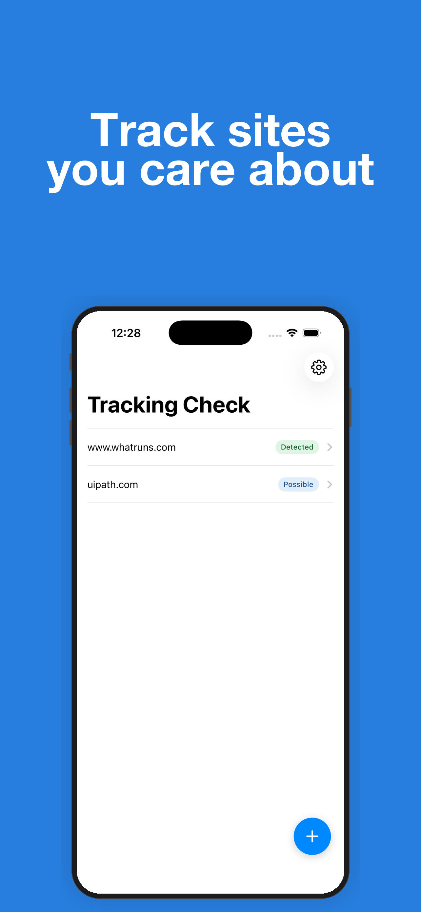
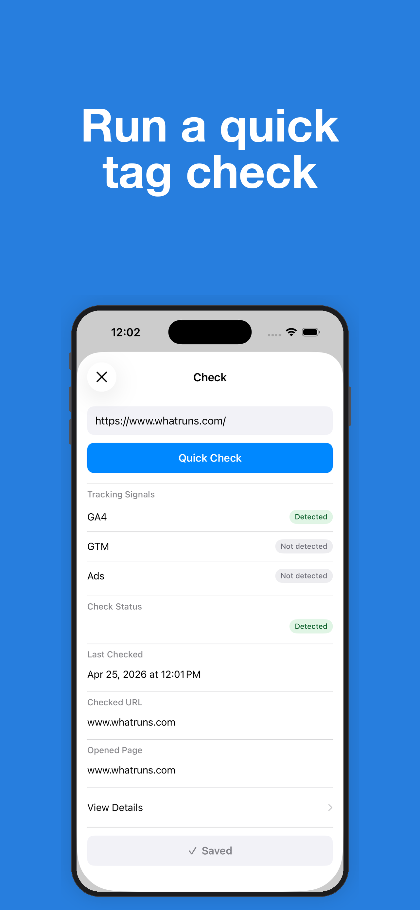
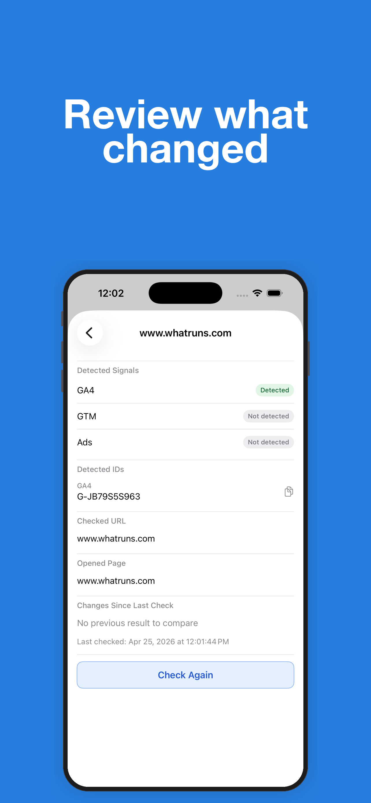

# Tracking Check

A small iPhone utility for checking whether a website appears to use GA4, GTM, and Google Ads. Run a quick check, save important sites, and compare changes over time without creating an account.

Service URL: App Store link coming soon

---

## Screenshots

  
  
  

---

## Features

- Check a site for GA4, GTM, and Google Ads signals
- See a simple result with `Detected`, `Possible`, `Not detected`, or `Check failed`
- Save sites locally and re-check them later
- Review detected IDs, checked URL, opened page, and change summaries
- **Free:** Save up to 3 sites and view summary differences after a new check
- **Pro:** Unlock detailed difference output for repeated checks

---

## How It Works

1. Enter a website URL and run `Quick Check`
2. The app loads the page and looks for GA4, GTM, and Google Ads signals
3. Review the result summary and open the details screen if needed
4. Save the site locally to keep it on the home list
5. Check again later to compare what changed

---

## Tech

- SwiftUI
- iOS 17+, iPhone-focused
- Local-first storage with `UserDefaults`
- StoreKit 2 for the one-time Pro unlock

---

## Status

In active development for App Store release.
